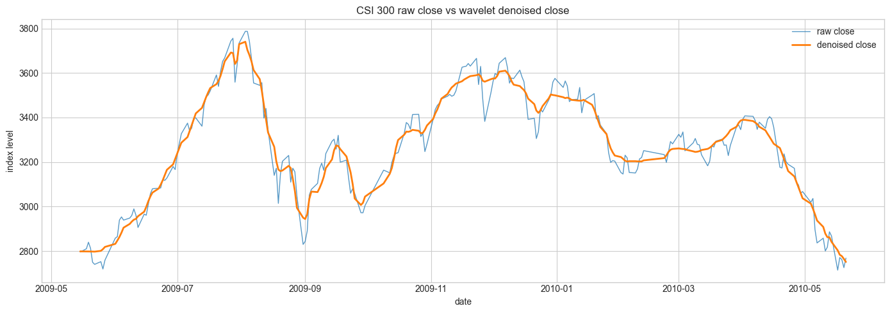
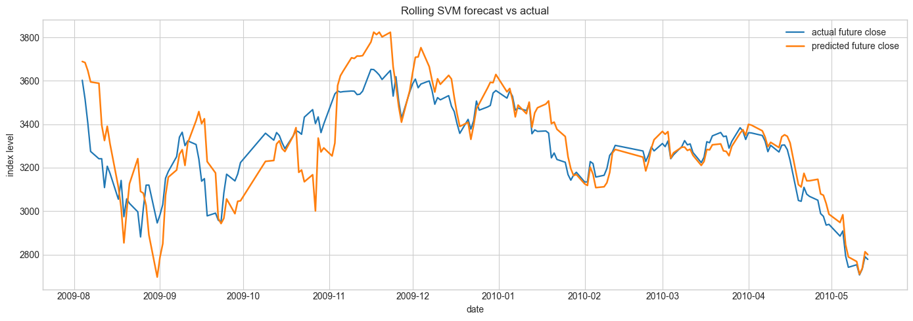

## 基于小波分析和支持向量机的指数预测模型 

复现国信证券《基于小波分析和支持向量机的指数预测模型》。使用数据为沪深300日线。

支持向量机（support vector machine, SVM）是数据挖掘中的一项新 技术，是借助于最优化方法解决机器学习问题的新工具。它成为克服“维 数灾难”和“过学习”等传统困难的有效办法，虽然他还处在飞速发展 的阶段，但它的理论基础和实现途径的基本框架已经形成。支持向量机 目前主要用来解决分类问题（模式识别，判别分析）和回归问题。而股 市行为预测通常为预测股市数据的走势和预测股市数据的未来数值。而 当我们将走势看作两种状态（涨、跌），问题便转化为分类问题，而预 测股市未来的价格是指为典型的回归问题。我们有理由相信支持向量机 可以对股市进行预测。 

### 小波去噪

首先，对实际信号进行小波分解，选择小波并确定分解层次为N，则噪声部分 通常包含在高频中。然后对小波分解的高频系数进行门限阀值量化处理。最后根据 小波分解的第N层低频系数和经过量化后的1至N层高频系数进行小波重构，达 到消除噪声的目的，即抑制信号的噪声，在实际信号中恢复真实信号。 

使用`pytorch`的`wavelet`库对数据进行去噪。通过小波分解得到4层数据。在保留高频数据的同时，按照sqtwolog阀值估计准则对低频数据进行去噪。然后将去噪后的低频数据与高频数据结合进行小波重建，即得去噪后的数据，效果如下图

### 支持向量机

支持向量机目前主要用来解决分类问题（模式识别，判别分析）和回归问题。 而股市行为预测通常为预测股市数据的走势和预测股市数据的未来数值。而当我们 将走势看作两种状态（涨、跌），问题便转化为分类问题，而预测股市未来的价格 是指为典型的回归问题。我们有理由相信支持向量机可以对股市进行预测。

研报里给出的两个核心数字是：

\- 每日涨跌方向准确率约 `68.5%` ，我们的复现结果为`68.9%`

\- 预测走势和真实走势相关系数约 `0.78`，我们的复现结果为`0.88`

同时绘制出滑动预测图，可以发现存在滞后性。

